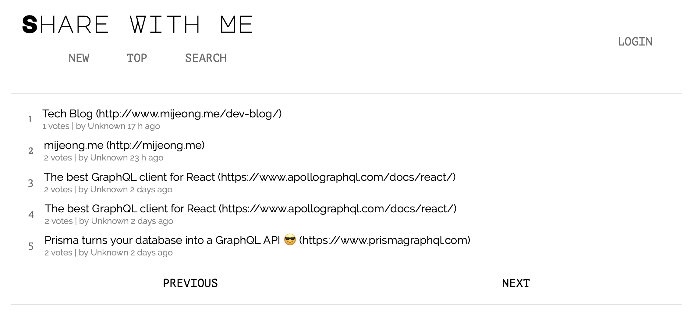

# Share With Me 
Let's share useful links that a developer should visit!  


## How to locally use the app
1. Clone
`git@github.com:halfundecided/sharewithme-react-graphql.git`

2. Install dependencies and deploy the Prisma database API
Run the following commands:
```
$ yarn global add prisma
$ cd sharewithme-react-graphql/server
$ yarn install
$ prisma deploy
```
Select Demo server OR run Prisma locally via Docker

3. Run the server 
```
$ cd sharewithme-react-graphql/server
$ yarn start
```

4. Run the app
In sharewithme-react-graphql directory,
```
$ yarn install
$ yarn start
```

## Deployment with Heroku
Coming soon!

## Features
- [x] Display a list of links
- [x] Search the list of links
- [x] Users can authenticate
- [x] Authenticated users can create new links
- [x] Authenticated users can upvote links (one vote per link and user)
- [x] Realtime updates when other users upvote a link or create a new one 

## Tech
+ Frontend:
  + React for building user interfaces 
  + Apolli Client: Production-ready, caching GraphQL client
+ Backend:
  + graphql-yoga: Fully-featured GraphQL Server
  + Prisma: GraphQL API layer that turns database into a GraphQL API
  